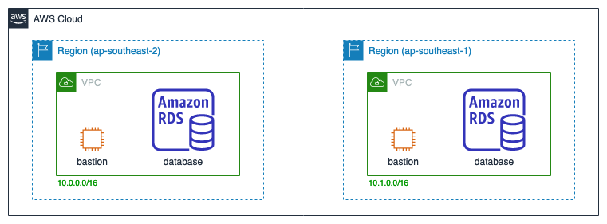

# AWS Database Migration Service Inter-region Demo Environment Setup

This CDK provides set up for demo of inter-region RDS migration by using AWS 
Database Migration Service.

## Architecture

**Initial architecture** The initial architecture consists of 2 stack in 2 different region.
Each stack has 1 RDS and 1 Bastion host. The bastion host can be accessed through EC2 Instance Connect.




## Running

To run the CDK script first set environment variable `CDK_DEFAULT_ACCOUNT` with 
your account ID, or you can set the value of variable `accountId` in
`bin/dms-migration.ts` source.

To execute the script, run.

```
cdk deploy --all
```

## Cleaning Up

Before cleaning up the resource created by this CDK code, you need to clean up
the resource you already created manually, e.g. VPC peering, DMS, etc.

After that you can execute the command below.

```
cdk destroy --all
```